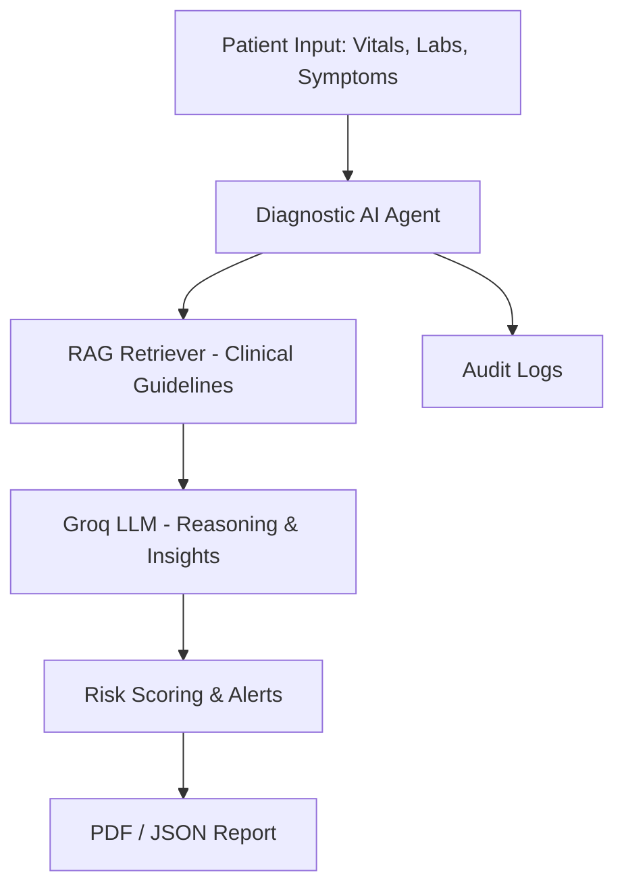
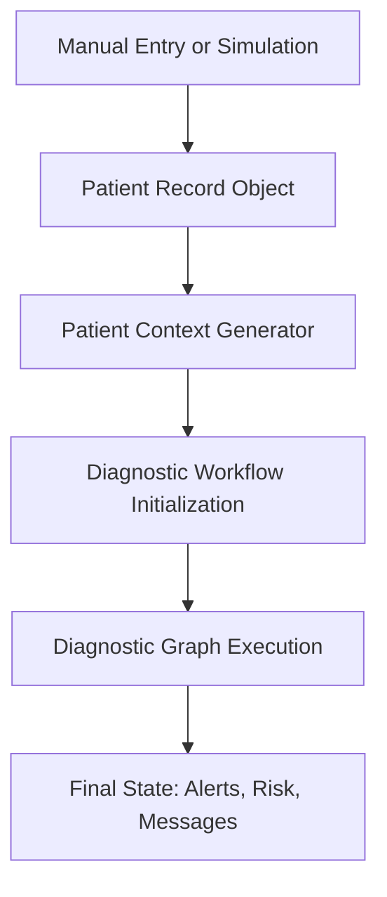
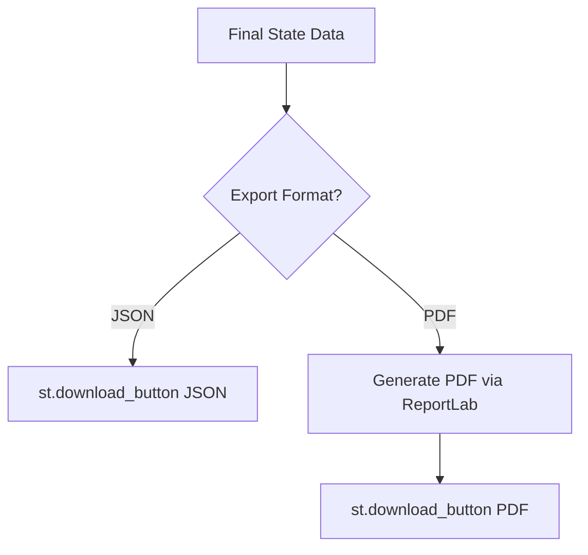
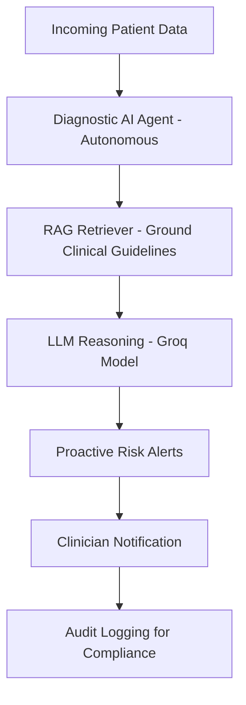

# 🧠 RAGnosis: The Diagnostic AI Agent

### Bridging fragmented healthcare data with autonomous, proactive intelligence.

---

## The Real Healthcare Challenge

Primary care doctors see **20–40 patients per day**, each with scattered data across systems:

- 🧪 **Lab results** arrive hours or days later  
- 🩺 **Vital signs** are taken but not analyzed holistically  
- 📝 **Previous visit notes** are scattered across EHRs  
- 💬 **Patient portal messages** often go unnoticed  

### The result? Critical patterns are missed.

#### Example Scenario:

> **Monday:** Patient reports *"chest tightness"* → Sent home  
> **Tuesday:** Troponin result = *0.15 (elevated)* → Doctor doesn't see it yet  
> **Wednesday:** Patient says *"feeling winded"* in portal  
> **Thursday:** Patient has **heart attack in ER**

The warning signs were there.  
No one connected the dots in time.

---

## Real Statistics

- ⚠️ 12–15% of heart attacks are **missed** in initial evaluations  
- ⏱️ Each 1-hour delay in sepsis diagnosis → **7% higher mortality**  
- 💀 40,000–80,000 deaths/year due to **diagnostic errors** (U.S.)

---

## Why This Happens

- Doctors are **overwhelmed with fragmented data**  
- No system to **proactively analyze** results as they arrive  
- Alerts come **too late** (after deterioration begins)  
- Lab, vitals, and symptom systems are **disconnected**

---

## Our Solution: **RAGnosis — Diagnostic AI Agent**

An **autonomous AI agent** that connects the dots **before** it's too late.

### What It Does

✅ Continuously monitors fragmented patient data  
✅ Analyzes vitals, labs, and symptoms in real-time  
✅ Retrieves **clinical guidelines** using RAG (Retrieval-Augmented Generation)  
✅ Detects high-risk patterns *before* emergencies  
✅ Proactively alerts clinicians with recommendations  
✅ Maintains a full audit trail for **compliance and accountability**

---

## Key Innovation: Agentic AI + RAG

### Agentic AI — Not Just Another Chatbot

- ❌ **Competitors:** Passive Q&A tools (doctor asks → AI answers)  
- ✅ **RAGnosis:** Autonomous agent that works **24/7**, analyzes incoming data, and acts **without prompts**

### Retrieval-Augmented Generation (RAG)

- ❌ **Pure LLMs:** Can hallucinate dangerous medical facts  
- ✅ **RAGnosis:** Grounds every insight in **real clinical guidelines**, ensuring factual, defensible reasoning

### Proactive, Not Reactive

- ❌ Traditional systems wait for deterioration  
- ✅ RAGnosis **predicts** risk patterns and alerts early

### Full Audit Trail

- ❌ Black-box AI → "Why did it alert?" Unknown  
- ✅ Transparent reasoning logs every decision, making AI **legally defensible**

### Real Clinical Impact

- Prevents **missed diagnoses**  
- Reduces **ER visits and hospitalizations**  
- Eases **physician burnout** through cognitive support

---

## Business Case

### Problem Scale

- 280M+ annual patient visits in U.S. primary care  
- 12–15% acute MI (heart attack) missed initially  
- $17.1B/year cost from diagnostic errors  

### Impact Potential

| Metric | Outcome | Annual Impact |
|:--------|:---------|:---------------|
| Prevent 5% of missed diagnoses | +14,000 lives saved | 💚 |
| Reduce ER visits by 10% | $1.7B cost saved | 💰 |
| Detect sepsis 1 hr earlier | 7% lower mortality | 🩸 |

### Revenue Model

- SaaS: **$50/month/physician**  
- 500,000 U.S. primary care doctors  
- **TAM ≈ $300M/year**

---

## Tech Stack & Architecture

### Core Technologies

- **Python 3.12+**
- **Streamlit** — UI dashboard  
- **Groq + LLaMA 3.3** — LLM inference  
- **LangGraph / Agentic Workflow Engine**  
- **Retrieval-Augmented Generation (RAG)** — Evidence-grounded context  
- **ReportLab** — PDF report generation  
- **PyPDF / JSON** — Data export  
- **dotenv** — Secure API key management  

---

### System Architecture & Workflows

#### High-Level Workflow

#### Patient Data Processing Flow

#### Report Export Flow

#### End-to-End System Flow

